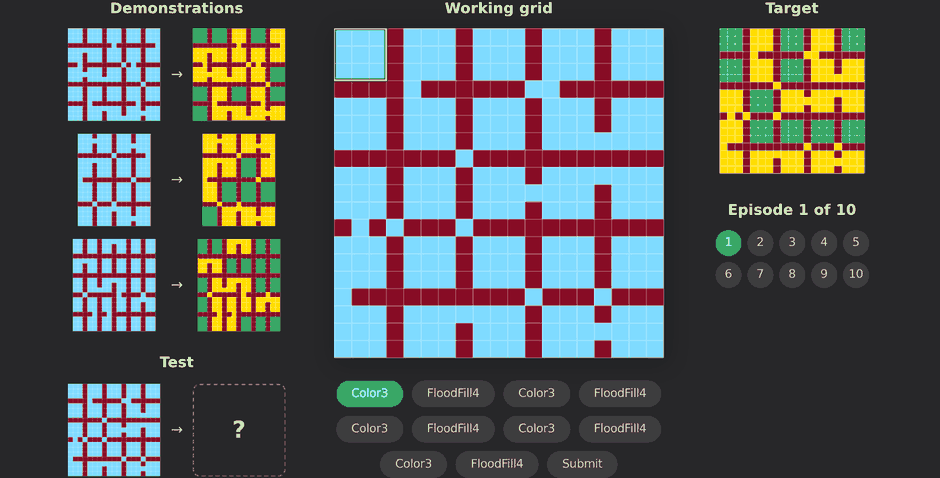

# SOLAR(Synthesized Offline Learning data for Abstraction and Reasoning)

**Executable ARC solutions.** Every task in this repository ships a
`grid_maker.py` that samples fresh input grids *and* emits the
[ARCLE](https://github.com/ConfeitoHS/arcle) operation sequence that solves
them — so rolling one out yields a replayable trajectory (select → recolor →
move → paste → submit), not just an input/output pair.

[](LICENSE)
[](https://www.python.org/)
[](https://github.com/ConfeitoHS/arcle)

### [Browse the trajectories &rarr;](https://qazyunho.github.io/SOLAR-V2/) &nbsp;·&nbsp; [Dataset on Hugging Face &rarr;](https://huggingface.co/datasets/dbsgh797210/SOLAR)



**400 makers, one per task of the ARC-AGI-1 training split.** Inputs come from
each task's [RE-ARC](https://github.com/michaelhodel/re-arc) generator, so any maker can be rolled out for as many fresh
instances as you want — the published dataset is one draw of them, not their
limit (see [Download](#download)).

---

## Setup

Python 3.11, developed and verified on 3.11.15.

```bash
git clone https://github.com/QAZyunho/SOLAR-V2.git solar-traj
cd solar-traj
pip install -r requirements.txt
```

No build step and no package install. Every entry point is a script under
`pipeline/` or `viz/`, run from the repository root. `requirements.txt` pins
`arcle == 0.2.5`; the recording format depends on that version's observation
dict.

Rollouts do not live in the repository — a full draw is tens of gigabytes. The
scripts that read or write them take a directory and default to `./solar-data`:

```bash
export SOLAR_DATA_ROOT=/somewhere/with/space          # or pass --data_folder
```

Some things are optional, and only some scripts want them:

| | |
|---|---|
| ARC-AGI-1 data | `pipeline/probe_originals.py` only. A clone of [fchollet/ARC-AGI](https://github.com/fchollet/ARC-AGI); point at it with `$SOLAR_ARC_DIR` or `--arc_dir` |
| `claude` CLI | The two LLM scripts only (`pipeline/gen_rearc_makers_llm.py`, `pipeline/critique_makers_llm.py`). They shell out to [Claude Code](https://claude.com/claude-code), so there is no separate API key |

`--data_root`, `--out`, `--arc_dir` and `--data_folder` each override their
environment variable.

## Quick Start

### Step 1: Generate trajectories

```bash
# one task, 10 episodes — CPU only, no LLM calls, seconds
python pipeline/gen_rearc_trajectories_v2.py \
    --subfolder arc-agi-1 \
    --tasks 05f2a901 \
    --num_samples 10 \
    --rand_seed 0 \
    --max_grid_dim 30 30 \
    --data_folder solar-data/draw0
```

One JSON per episode, under a directory named for the task and the day:

```
solar-data/draw0/whole/test.05f2a901.s30.26.08.18/05f2a901-rearc-llm_1.json
```

Drop `--tasks` and all 400 makers roll out.

### Step 2: Visualize a trajectory

```bash
# a still figure: the worked examples, then the episode step by step
python viz/visualize_trajectory.py \
    --root solar-data/draw0/whole \
    --task 05f2a901 \
    --out figure/mine.png

# the same episode as a GIF
python viz/visualize_trajectory_gif.py \
    --root solar-data/draw0/whole \
    --task 05f2a901 \
    --out figure/mine.gif
```


## Layout

```
.
├── docs/                             the GitHub Pages viewer; carries no data of its own
│   ├── .nojekyll
│   ├── arcle_reference.md
│   ├── hero.png
│   └── index.html
├── figure/                           teaser.png and teaser.gif
│   ├── teaser.gif
│   └── teaser.png
├── maker/                            keep at the root — makers assume it
│   ├── arc-agi-1/                    400  ARC-AGI-1 training tasks, LLM-written
│   │   └── … 400 task directories
│   ├── handcraft/                     10  hand-written, kept as a control
│   │   └── … 10 maker directories
│   ├── __init__.py
│   ├── base_grid_maker.py
│   └── sel_helpers.py
├── pipeline/                         GENERATE / CHECK / REFINE, plus rollout and export
│   ├── README.md                     every script and flag, and the loop in full
│   ├── build_preview.py
│   ├── critique_makers_llm.py
│   ├── critique_to_feedback.py
│   ├── export_release.py
│   ├── gen_rearc_makers_llm.py
│   ├── gen_rearc_trajectories_v2.py
│   ├── probe_originals.py
│   ├── utils.py
│   └── verify_grid_makers.py
├── re-arc/                           vendored RE-ARC generators, verifiers, DSL (Apache-2.0)
│   ├── NOTICE
│   ├── dsl.py
│   ├── generators.py
│   ├── utils.py
│   └── verifiers.py
├── viz/                              figures, GIF, and the gallery pages
│   ├── README.md
│   ├── build_handcraft_gallery.py
│   ├── build_hero_bg.py
│   ├── visualize_trajectory.py
│   └── visualize_trajectory_gif.py
├── .gitignore
├── LICENSE
├── README.md
└── requirements.txt
```

`maker/` and `re-arc/` cannot be moved. Every generated `grid_maker.py`
resolves the repo root as its own `parents[3]` and puts `<root>/re-arc` on
`sys.path` itself, so relocating either breaks 410 files that are outputs, not
sources. Everything else is ours and moves freely.

## Generating a dataset

Two commands. The first rolls makers out into trajectories, the second packs
those into parquet shards.

```bash
# 400 makers x 25 samples: CPU only, no LLM calls, ~15 min
python pipeline/gen_rearc_trajectories_v2.py --subfolder arc-agi-1 \
    --num_samples 25 --rand_seed 0 --max_grid_dim 30 30 \
    --data_folder $SOLAR_DATA_ROOT/draw0

# pack it, round-trip checking 40 rows against the source JSON
python pipeline/export_release.py --subsets arc_agi1 --verify 40
```

`--subfolder` names the maker set. `arc-agi-1` is the 400 makers this release
was rolled out from; [`pipeline/README.md`](pipeline/README.md) covers the rest
of the flags, and what the other set in `maker/` needs.

`--num_samples` is the only thing standing between 4,000 trajectories and
40,000. The makers are generators, so the published dataset is one draw rather
than a ceiling, and a different `--rand_seed` gives a disjoint one.

A sample reaches disk only if its final grid matches the target, so a rollout
**drops** what it cannot solve rather than repairing it. The released draw kept
3,975 of 4,000, with every task yielding at least 6.

Every recorded tensor is padded to `--max_grid_dim` with fill value **10**
(colours occupy 0-9); the true extent lives in `grid_dim`, `clip_dim`,
`ex_in_grid_dim` and `ex_out_grid_dim`.

The checks that produced these makers, and every flag of every script, are in
[`pipeline/README.md`](pipeline/README.md). The figure and gallery tools are in
[`viz/README.md`](viz/README.md).

## How the makers were written

The loop is one recipe, and this repository is one run of it. A model writes the
route as code; replaying that code in ARCLE decides whether it survives; a
rejection goes back carrying the pair it failed and what it produced instead,
never a diagnosis; rounds continue until it passes, and each task keeps its best
maker. What changes from corpus to corpus is only which gates are available to
run, and more of them is strictly better — with a generator you can also demand
fresh instances, and with the original ARC pairs you can demand the same route
replay on those. Real ARC-AGI-2 tasks went through the same loop on the gates
that corpus allows.

The run that produced the makers here had all of them. A maker starts as one LLM
generation — `generate()`, `sample_colors()` and `derive_operations()` for a
single task, written from the RE-ARC generator and verifier plus that task's
original ARC pairs. It then has to survive **four kinds of check**:

| check | what it asks | where |
|---|---|---|
| **simulation** | do the ops turn I into O; does the grid revisit a state; is any op removable with O still reached | inside the generating conversation, so a rejection is re-prompted immediately, up to 3 tries |
| **samples** | do N *fresh* instances all reach the target, not just the ones it was written on | `pipeline/verify_grid_makers.py` |
| **critic** | replaying an episode, does the route match the solver's concept | `pipeline/critique_makers_llm.py` |
| **originals** | does the same solution replay on the task's own original ARC pairs | `pipeline/probe_originals.py` |

**These are four filters, not four stages.** They were added at different points
and ran in different orders and combinations from round to round. The honest
description is that every maker ended up passing all four, not that it walked a
fixed 1→2→3→4. Whatever a round found became per-task feedback for the next
one, and each task kept its best maker. Nothing here was generated in one shot.

[`pipeline/README.md`](pipeline/README.md) has the recipe, what each corpus
changes about it, and the loop in full.

## Writing your own

A maker subclasses `BaseGridMaker` and implements `parse(**kwargs)`, returning
`(ex_in, ex_out, pr_in, pr_out, desc)` per sample, where `desc` carries
`operations` and `selections`. Start from any file under `maker/arc-agi-1/`,
then:

```bash
python pipeline/probe_originals.py    --subfolder <your_set>   # solves the original pairs?
python pipeline/verify_grid_makers.py --subfolder <your_set>   # fresh samples reach the target?
```

Both run on CPU with no LLM calls. Run `probe_originals.py` first: it is the one
that catches a `generate()` which has drifted away from the task.

`docs/arcle_reference.md` is the operation reference makers are written
against, and is also what the generator prompt is built from. The rest of the
checks, and how to feed their output back into generation, are in
[`pipeline/README.md`](pipeline/README.md).

## Download

The rolled-out trajectories are published as a separate dataset in parquet,
with the loader and schema documented there:
**[dbsgh797210/SOLAR](https://huggingface.co/datasets/dbsgh797210/SOLAR)**.

```python
from datasets import load_dataset
ds = load_dataset("dbsgh797210/SOLAR", "arc_agi1", split="train")
```

Nothing here depends on it. `pipeline/gen_rearc_trajectories_v2.py` regenerates
trajectories from the makers on CPU in a few minutes.

## License

Apache-2.0 (see [LICENSE](LICENSE)). Built on, and would not exist without:

- [RE-ARC](https://github.com/michaelhodel/re-arc) (Michael Hodel, Apache-2.0) —
  the input generators and verifiers vendored in `re-arc/` (see
  [`re-arc/NOTICE`](re-arc/NOTICE))
- [ARC-AGI-1](https://github.com/fchollet/ARC-AGI) (Apache-2.0) — the tasks
- [ARCLE](https://github.com/ConfeitoHS/arcle) — the environment these
  trajectories are written in
